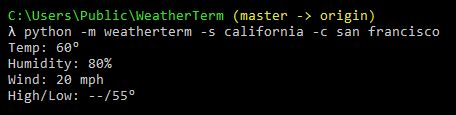
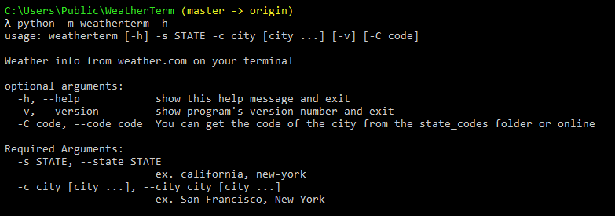

# WeatherTerm
#### A simple command line parser interface for weather information via weather.com

## Installation 
### a. Requirements
Install requirements by typing the following command:

```
pip install -r requirements.txt
```
OR
```
python -m pip install -r requirements.txt
```

## Running the module
Since this is intented as a python module, you have to run it with the -m command. Be inside the WeatherTerm directory and use the following command:
```
python -m weatherterm -s [STATE] -c [CITY]
```
### Example


## Help 
To display the help menu use:
```
python -m weatherterm -h
```
OR
```
python -m weatherterm --help
```


## Features
* Display info about current temperature, humidity, wind speed, and high/low temp of the day
* Find weather info on any city in the U.S 

## TO-DO
- [ ] Forecast future weather (ex. Five-day, Ten-day, Weekend)
- [ ] Add icons and stylize the interface
- [ ] Unit conversion
- [ ] Possible migration into a full-fledged CLI
- [ ] Option to use different parsers and API

## Skills Learned 
- Web-scraping using the Requests and BeautifulSoup libraries 
- Using argparse to build command-line parsers
- Enumeration using the Enum object
- 
